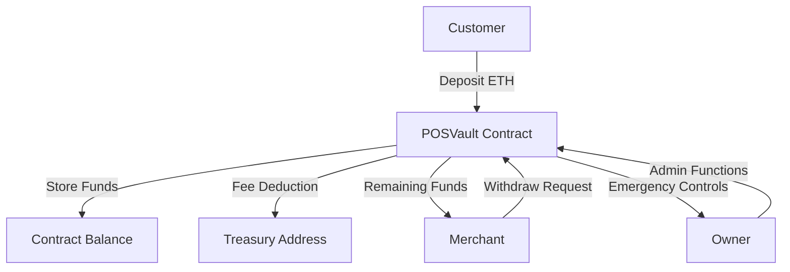
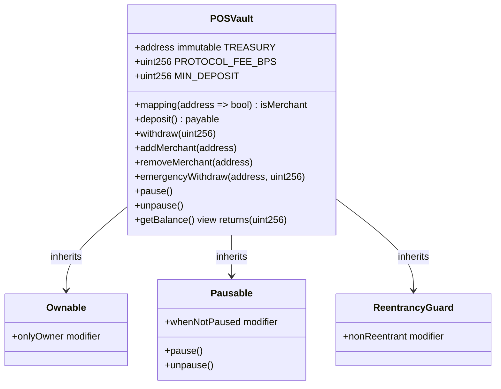
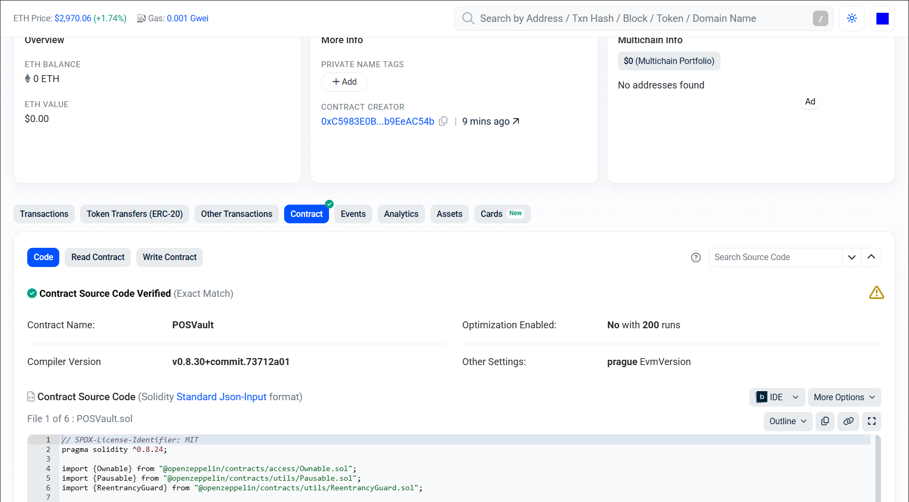
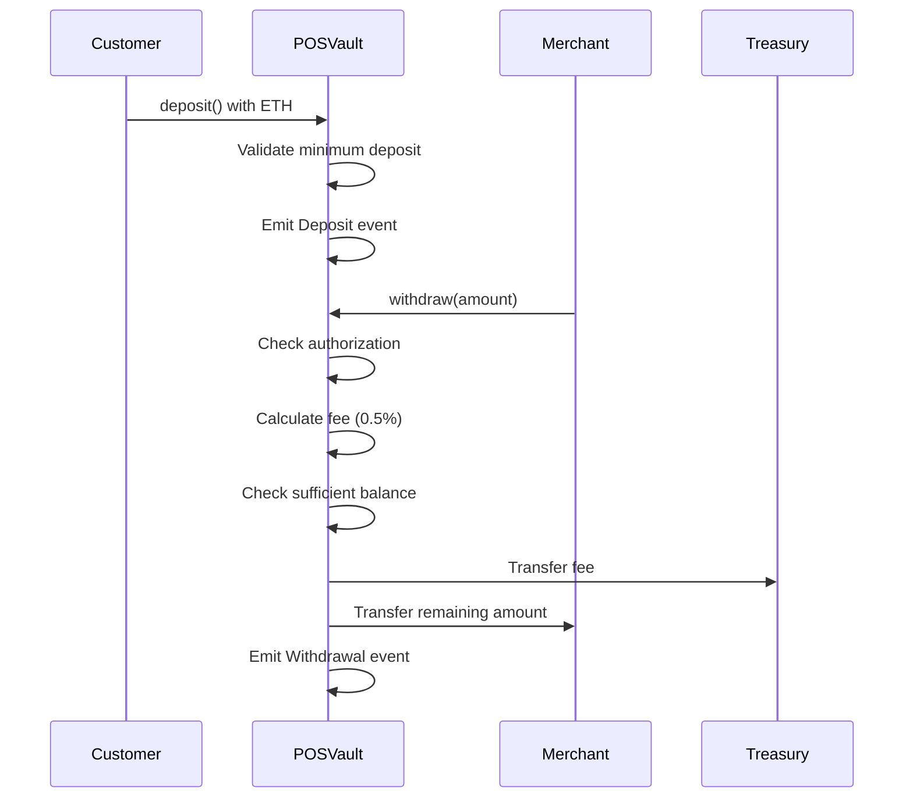

# POSVault: Decentralized POS Payment Vault


[](https://soliditylang.org/)
[](https://book.getfoundry.sh/)
[](https://openzeppelin.com/contracts/)
[](https://base.org/)
[](https://opensource.org/licenses/MIT)
[](https://github.com/your-repo/test-results)
[](https://basescan.org/)

**A secure, gas-optimized decentralized payment vault for Base blockchain that enables merchants to collect ETH payments while generating protocol fees for leaderboard tracking.**

*Streamline point-of-sale transactions with WalletConnect integration, multi-merchant support, and automated fee collection.*

---

*This comprehensive guide covers everything from architecture to deployment for building secure payment solutions on Base.*


## Table of Contents

- [POSVault: Decentralized POS Payment Vault](#posvault-decentralized-pos-payment-vault)
  - [Table of Contents](#table-of-contents)
  - [Overview](#overview)
  - [Features](#features)
  - [Architecture](#architecture)
    - [Key Components](#key-components)
  - [Contract Design](#contract-design)
  - [Contract Flow](#contract-flow)
  - [Prerequisites](#prerequisites)
    - [Foundry Installation](#foundry-installation)
    - [Solidity Version](#solidity-version)
  - [Installation](#installation)
  - [Setup](#setup)
  - [Usage](#usage)
    - [For Merchants](#for-merchants)
    - [For Customers](#for-customers)
    - [Administrative Functions](#administrative-functions)
  - [Deployment](#deployment)
    - [Testnet Deployment](#testnet-deployment)
    - [Mainnet Deployment](#mainnet-deployment)
  - [Testing](#testing)
  - [Security](#security)
    - [Security Measures](#security-measures)
    - [Audit Status](#audit-status)
    - [Known Limitations](#known-limitations)
  - [Contributing](#contributing)
    - [Development Workflow](#development-workflow)
  - [License](#license)
  - [Acknowledgments](#acknowledgments)

## Overview

POSVault is a secure, gas-optimized decentralized payment vault contract designed for the Base blockchain (Chain ID: 8453). It enables merchants to receive ETH payments from customers via WalletConnect QR scans while collecting a protocol fee to generate measurable on-chain fees for leaderboard tracking.

The contract implements a merchant-controlled withdrawal system with emergency controls, ensuring secure fund management for point-of-sale applications.

## Features

- **Secure Deposits**: Customers can deposit ETH with a minimum threshold to prevent spam
- **Merchant Withdrawals**: Authorized merchants can withdraw funds with automatic 0.5% protocol fee deduction
- **Protocol Fee Generation**: 0.5% of all withdrawals sent to treasury for leaderboard metrics
- **Emergency Controls**: Owner can pause operations and perform emergency withdrawals
- **Multi-Merchant Support**: Flexible system allowing multiple authorized merchants
- **Gas Optimization**: Custom errors and efficient mappings for reduced gas costs
- **Reentrancy Protection**: Built-in safeguards against reentrancy attacks

## Architecture

The POSVault contract follows a modular architecture leveraging OpenZeppelin contracts for security and reliability.



### Key Components

- **Access Control**: Ownable for administrative functions
- **Security Layers**: Pausable and ReentrancyGuard for operational safety
- **Fee Mechanism**: Immutable treasury with fixed 0.5% protocol fee
- **Merchant Management**: Mapping-based authorization system

## Contract Design

The contract design emphasizes security, modularity, and gas efficiency.



---


## Contract Flow

The contract flow diagram illustrates the complete lifecycle of a payment transaction.



----


## Prerequisites

- Foundry (latest version)
- Node.js 18+ (for additional tooling)
- Git
- Base network RPC access

### Foundry Installation

```bash
curl -L https://foundry.paradigm.xyz | bash
foundryup
```

### Solidity Version

- Compiler: ^0.8.24
- OpenZeppelin Contracts: 5.x

## Installation

Clone the repository and install dependencies:

```bash
git clone <repository-url>
cd based-pos-contract-solidity
forge install
```

## Setup

1. Copy environment template:
```bash
cp .env.example .env
```

2. Configure environment variables in `.env`:
```bash
BASE_MAINNET_RPC_URL=https://mainnet.base.org
BASE_SEPOLIA_RPC_URL=https://sepolia.base.org
BASESCAN_API_KEY=your_basescan_api_key
```

3. Set up Foundry keystore:
```bash
cast wallet import defaultKey --private-key <your-private-key>
```

## Usage

### For Merchants

1. **Add Merchant**: Owner adds authorized merchant addresses
```solidity
vault.addMerchant(merchantAddress);
```

2. **Receive Payments**: Customers deposit ETH directly to vault
```solidity
vault.deposit{value: amount}();
```

3. **Withdraw Funds**: Merchant withdraws with automatic fee deduction
```solidity
vault.withdraw(amount);
```

### For Customers

Customers interact with the vault through WalletConnect-enabled applications:

```solidity
// Minimum deposit: 0.001 ETH
vault.deposit{value: 0.01 ether}();
```

### Administrative Functions

```solidity
// Pause operations
vault.pause();

// Add merchant
vault.addMerchant(address);

// Emergency withdrawal
vault.emergencyWithdraw(to, amount);
```

## Deployment

### Testnet Deployment

Deploy to Base Sepolia testnet:

```bash
./deploy-posvault-testnet.sh
```

Contract Address: `0xF917CBB2568917115E35bDe29059b62e8baC8c02`

### Mainnet Deployment

Deploy to Base mainnet:

```bash
./deploy-posvault-mainnet.sh
```

Contract Address: `0x136a701d3C7B5E1a0936c8eCC7FD3b3aC133E124`

Both deployments automatically verify contracts on Basescan.

## Testing

Run the comprehensive test suite:

```bash
forge test
```

Test coverage includes:
- Deposit validation (minimum amounts, paused state)
- Withdrawal mechanics (fees, authorization, balance checks)
- Merchant management
- Emergency functions
- Security edge cases

```bash
# Run with gas reporting
forge test --gas-report

# Run specific test
forge test --match-test testWithdrawByMerchant
```

## Security

### Security Measures

- **Reentrancy Protection**: Non-reentrant modifier on state-changing functions
- **Access Control**: Owner-only administrative functions
- **Emergency Pause**: Circuit breaker for critical situations
- **Input Validation**: Comprehensive checks on all inputs
- **Low-level Calls**: Safe ETH transfers with success verification

### Audit Status

The contract uses battle-tested OpenZeppelin components and follows security best practices. For production use, consider a formal security audit.

### Known Limitations

- Treasury address is immutable after deployment
- Protocol fee is fixed at 0.5%
- No upgrade mechanism implemented

## Contributing

We welcome contributions from the community. Please follow these guidelines:

1. Fork the repository
2. Create a feature branch
3. Write comprehensive tests
4. Ensure all tests pass
5. Submit a pull request with detailed description

### Development Workflow

```bash
# Install dependencies
forge install

# Run tests
forge test

# Format code
forge fmt

# Check linting
forge build
```

## License

This project is licensed under the MIT License. See [LICENSE](LICENSE) for details.

## Acknowledgments

- OpenZeppelin for secure contract components
- Foundry for development tooling
- Base blockchain for L2 infrastructure
- Talent Protocol for builder incentives

---

Built with ❤️ for the Base ecosystem
